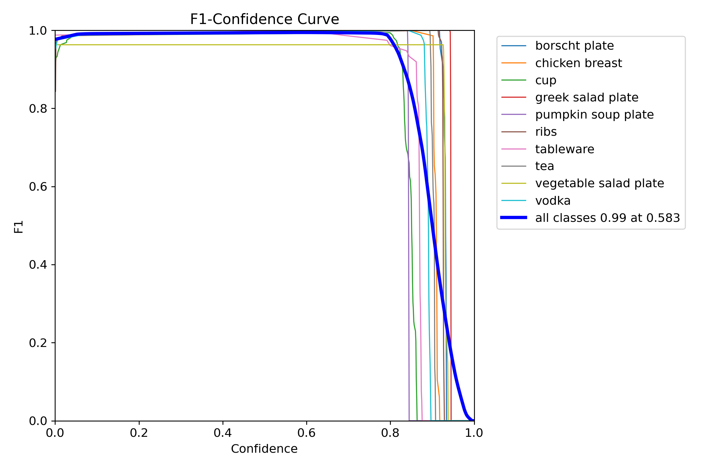
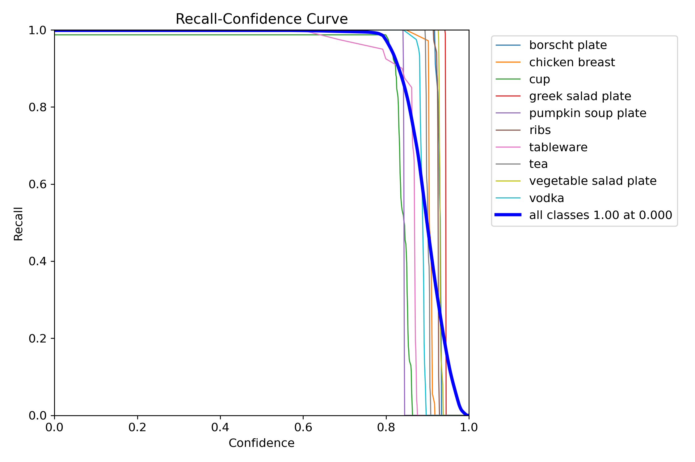
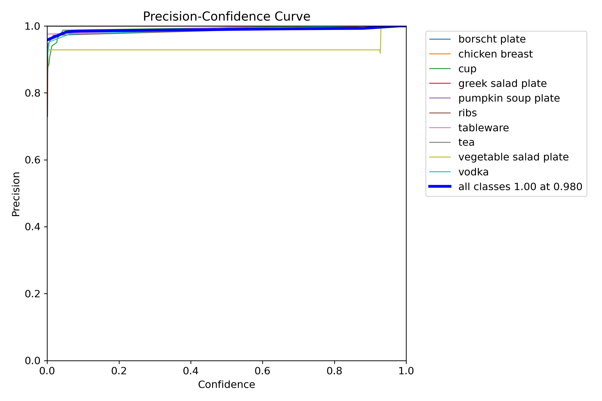

# Модель распознавания блюд — Обзор рабочего процесса

---

## Описание рабочего процесса

Полный цикл подготовки модели компьютерного зрения для распознавания блюд из видео с помощью YOLOv8

---

## Дано

- **Техническое задание**
- **Набор данных**: 6 видеороликов, продолжительностью от **30 секунд** до **1 минуты 30 секунд**

---

## Разметка

**Выбран инструмент**: [Roboflow](https://roboflow.com) — удобная платформа со встроенными возможностями расширения

**Предприняты шаги**:
- Извлечены кадры **1 кадр в секунду** → **всего 290 кадров**  
- Выбранный тип разметки: **Обнаружение объекта**
- В процессе разметки пришло осознание - блюд в меню больше, чем показано в видео → модель нуждается в дальнейшей доработке

**Настройки аугментации**:
- Поворот: ±20°
- Наклон: ±10% по горизонтали и вертикали
- Оттенки: ±20%
- Насыщенность: ±25%
- Яркость: ±15%
- Размытие: до 3 пикселей
- Уровень шума: до 0.65% на пиксель

Такие параметры выбраны в соответствии с логикой: камера может висеть под разными углами, с разным освещением. Также может быть разное качество камеры

**Соотношение датасета**:
- train: 75%  
- validation: 15%  
- test: 10%  

---

## Подготовка для обучения

В процессе возникли проблемы:
- Несоответствие версии CUDA
- Совместимость torch   
- Устаревшие драйверы видеокарты 

**Решение**: Обновлены драйверы видеокарты → проблема устранена

---

## Обучение модели

**Модель**: `YOLOv8n` — облегченная версия, подходящая для быстрой итерации и моего железа (RTX 3060 12Gb)

**Гиперпараметры**:
- `imgsz = 1024` — более высокое разрешение для повышения точности
- `batch = 16` — для стабильности градиента
- `epochs = 200` — достаточно большое число для сходимости, но не достаточно для переобучения

---

## Результаты

| Показатель         | Значение | Описание                                                |
|--------------------|----------|---------------------------------------------------------|
| **Precision (P)**  | 0.902    | Правильно предсказанные объекты среди всех предсказаний |
| **Recall (R)**     | 0.903    | Правильно предсказанные объекты среди всех реальных     |
| **mAP\@0.5**       | 0.903    | Средняя точность в IoU = 0,5                            |
| **mAP\@0.5:0.95**  | 0.773    | Средняя точность по долговым распискам от 0,5 до 0,95   |

**Результат F1**:

```
F1 = 2*((P*R)/(P+R)) = 2*((0.902*0.903)/(0.902+0.903)) = 0.90239
```

→ Указывает на четкий баланс между точностью и запоминанием

### Интерпретация:

* **Precision и Recall ≈ 0,9** → Небольшое количество ложных срабатываний или пропущенных обнаружений (хорошо)
* **mAP\@0.5 = 0,903** → Отличные базовые характеристики обнаружения (хорошо)
* **mAP\@0.5:0.95 = 0,773** → стабильная работа модели на разных уровнях строгости (можно лучше)

---

## Доработка и следующие шаги

* Модель хорошо показала себя при первоначальном тестировании
* Готова для развертывания
* План: Расширить набор данных + провести переподготовку, чтобы включить в него весь ассортимент меню. Также разбить видео по категориям - какие-то видео в трейн, а какие-то в тест (сейчас все кадры идут вперемешку)

---

## Варианты улучшения

* Попробовать изменить архитектуру (взять более точную модель, хотя бы `YOLOv9e`)
* Провести hyperparameter tuning через `yolo tune`
* Также попробовать использовать эту модель уже на проде, но по мере ее работы, постепенно дообучать

## Вывод

Модель хорошо подойдет для старта и будет показывать неплохой результат, но ее в любом случае нужно будет дообучать, чтобы она распознавала остальные блюда

---

# Новый старт

Получил правки от заказчика. Добавляем классы, меняем модель на более сильную `YOLOv9e`

### Новые классы

1. `borscht`
2. `borscht plate`
3. `chicken breast`
4. `cup`
5. `dishes`
6. `greek salad`
7. `greek salad plate`
8. `pumpkin soup`
9. `pumpkin soup plate`
10. `ribs`
11. `tableware`
12. `tea`
13. `vegetable salad`
14. `vegetable salad plate`
15. `vodka`


Первая проблема с которой столкнулись: CUDA out of memory

- `imgsz = 1024` — оставляем такое разрешение для сохранения точности модели
- `batch = 4` — понижаем, для того, чтобы уместиться в 12Gb видеопамяти и не потерять в точности
- `epochs = 230` — ставим число побольше, чтобы добиться большей точности, но не достичь переобучения

Модель обучалась около 25 часов.

Результаты получились лучше, чем на прошлой модели (остальные классы без изменений):

| Класс                 | P     | R     | mAP\@0.5 | mAP\@0.5:0.95 |
|-----------------------|-------|-------|----------|---------------|
| borscht plate         | 1.000 | 1.000 | 0.995    | 0.965         |
| chicken breast        | 1.000 | 1.000 | 0.995    | 0.866         |
| cup                   | 0.996 | 0.987 | 0.992    | 0.714         |
| greek salad plate     | 1.000 | 1.000 | 0.995    | 0.995         |
| pumpkin soup plate    | 1.000 | 1.000 | 0.995    | 0.860         |
| ribs                  | 0.990 | 1.000 | 0.995    | 0.868         |
| tableware             | 1.000 | 1.000 | 0.995    | 0.818         |
| tea                   | 1.000 | 1.000 | 0.995    | 0.838         |
| vegetable salad plate | 0.929 | 1.000 | 0.974    | 0.954         |
| vodka                 | 0.992 | 1.000 | 0.995    | 0.836         |

Если сравнивать с метриками по `test`

| Класс                 | mAP50-95 Val   | mAP50-95 Test | Разница | Вывод                          |
|-----------------------|----------------|---------------|---------|--------------------------------|
| borscht plate         | 0.965          | 0.971         | +0.006  |                                |
| chicken breast        | 0.866          | 0.838         | –0.028  | немного упало, но не критично  |
| cup                   | 0.714          | 0.749         | +0.035  | хорошее улучшение показателя   |
| pumpkin soup plate    | 0.860          | 0.711         | –0.149  | !!! сильно упало               |
| ribs                  | 0.868          | 0.876         | +0.008  |                                |
| tableware             | 0.818          | 0.839         | +0.021  | незначительное улучшение       |
| tea                   | 0.838          | 0.849         | +0.011  | незначительное улучшение       |
| vegetable salad plate | 0.954          | 0.951         | –0.003  |                                |
| vodka                 | 0.836          | 0.808         | –0.028  | немного упало, но не критично  |

### Вывод

`pumpkin soup plate`: снижение `mAP@0.5:0.95 на ~15%` может говорить о переобучении или сильном различии в данных для обучения
`chicken breast` и `vodka` - небольшое снижение, но в пределах нормы

## F1



## R



## P



